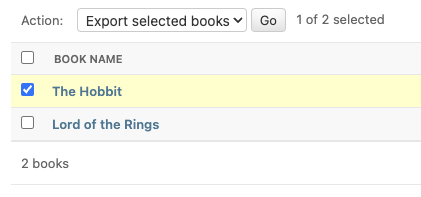

.. _admin-integration:

=================
Admin integration
=================

One of the main features of import-export is the support for integration with the Django Admin site.
This provides a convenient interface for importing and exporting Django objects.
Refer to the `Django Admin documentation <https://docs.djangoproject.com/en/stable/ref/contrib/admin/>`_ for details
of how to enable and configure the admin site.

You can also install and run the :ref:`example application<exampleapp>`  to become familiar with Admin integration.

Integrating import-export with your application requires extra configuration.

Admin integration is achieved by subclassing
:class:`~import_export.admin.ImportExportModelAdmin` or one of the available
mixins (:class:`~import_export.admin.ImportMixin`,
:class:`~import_export.admin.ExportMixin`,
:class:`~import_export.admin.ImportExportMixin`)::

    # app/admin.py
    from django.contrib import admin
    from .models import Book
    from import_export.admin import ImportExportModelAdmin

    @admin.register(Book)
    class BookAdmin(ImportExportModelAdmin):
        resource_classes = [BookResource]

Once this configuration is present (and server is restarted), 'import' and 'export' buttons will be presented to the
user.
Clicking each button will open a workflow where the user can select the type of import or export.

You can assign multiple resources to the ``resource_classes`` attribute.  These resources will be presented in a select
dropdown in the UI.

.. _change-screen-figure:

.. figure:: _static/images/django-import-export-change.png

   A screenshot of the change view with Import and Export buttons.

Importing
---------

To enable import, subclass :class:`~import_export.admin.ImportExportModelAdmin` or use
one of the available mixins, i.e. :class:`~import_export.admin.ImportMixin`, or
:class:`~import_export.admin.ImportExportMixin`.

Enabling import functionality means that a UI button will automatically be presented on the Admin page:

.. figure:: _static/images/import-button.png
   :alt: The import button

When clicked, the user will be directed into the import workflow.  By default, import is a two step process, though
it can be configured to be a single step process (see :ref:`import_export_skip_admin_confirm`).

The two step process is:

1. Select the file and format for import.
2. Preview the import data and confirm import.

.. _confirm-import-figure:

.. figure:: _static/images/django-import-export-import.png
   :alt: A screenshot of the 'import' view

   A screenshot of the 'import' view.

.. figure:: _static/images/django-import-export-import-confirm.png
   :alt: A screenshot of the 'confirm import' view

   A screenshot of the 'confirm import' view.

.. _import_confirmation:

Import confirmation
-------------------

To support import confirmation, uploaded data is written to temporary storage after
step 1 (:ref:`choose file<change-screen-figure>`), and read back for final import after step 2
(:ref:`import confirmation<confirm-import-figure>`).

There are three mechanisms for temporary storage.

#. Temporary file storage on the host server (default).  This is suitable for development only.
   Use of temporary filesystem storage is not recommended for production sites.

#. The `Django cache <https://docs.djangoproject.com/en/stable/topics/cache/>`_.

#. `Django storage <https://docs.djangoproject.com/en/stable/ref/files/storage/>`_.

To modify which storage mechanism is used, please refer to the setting :ref:`import_export_tmp_storage_class`.

Your choice of temporary storage will be influenced by the following factors:

* Sensitivity of the data being imported.
* Volume and frequency of uploads.
* File upload size.
* Use of containers or load-balanced servers.

Temporary resources are removed when data is successfully imported after the confirmation step.

**For sensitive data you will need to understand exactly how temporary files are being stored and to ensure
that data is properly secured and managed.**

.. warning::

    If users do not complete the confirmation step of the workflow,
    or if there are errors during import, then temporary resources may not be deleted.
    This will need to be understood and managed in production settings.
    For example, using a cache expiration policy or cron job to clear stale resources.

.. _customizable_storage:

Customizable storage
^^^^^^^^^^^^^^^^^^^^^

If using :class:`~import_export.tmp_storages.MediaStorage` as a storage module, then you can define which storage
backend implementation is used to handle create / read / delete operations on the persisted data.

If using Django 4.2 or greater, use the `STORAGES <https://docs.djangoproject.com/en/stable/ref/settings/#std-setting-STORAGES>`_
setting to define the backend, otherwise use :ref:`import_export_default_file_storage`.

You can either supply a path to your own custom storage backend, or use pre-existing backends such as
`django-storages <https://django-storages.readthedocs.io/>`_.

If no custom storage implementation is supplied, then the Django default handler is used.

For example, if using django-storages, you can configure s3 as a temporary storage location with the following::

    IMPORT_EXPORT_TMP_STORAGE_CLASS = "import_export.tmp_storages.MediaStorage"

    STORAGES = {
        "default": {
            "BACKEND": "django.core.files.storage.FileSystemStorage",
        },
        "import_export": {
            "BACKEND": "storages.backends.s3.S3Storage",
            "OPTIONS": {
                "bucket_name": "<your bucket name>",
                "region_name": "<your region>",
                "access_key": "<your key>",
                "secret_key": "<your secret>"
            },
        },
    }

.. _format_ui_error_messages:

How to format UI error messages
^^^^^^^^^^^^^^^^^^^^^^^^^^^^^^^

Admin UI import error messages can be formatted using the :attr:`~import_export.admin.ImportMixin.import_error_display`
attribute.

.. _admin_ui_exporting:

Exporting
---------

As with import, it is also possible to configure export functionality.

To do this, subclass :class:`~import_export.admin.ImportExportModelAdmin` or use
one of the available mixins, i.e. :class:`~import_export.admin.ExportMixin`, or
:class:`~import_export.admin.ImportExportMixin`.

Enabling export functionality means that a UI button will automatically be presented on the Admin page:

When clicked, the user will be directed into the export workflow.

Export is a two step process.  When the 'export' button is clicked, the user will be directed to a new screen,
where 'resource', 'fields' and 'file format' can be selected.

.. _export_confirm:

.. figure:: _static/images/django-import-export-export-confirm.png
   :alt: the export confirm page

   The export 'confirm' page.

Once 'submit' is clicked, the export file will be automatically downloaded to the client (usually to the 'Downloads'
folder).

It is possible to disable this extra step by setting the :ref:`import_export_skip_admin_export_ui` flag,
or by setting :attr:`~import_export.admin.ExportMixin.skip_export_form`.

.. _export_via_admin_action:

Exporting via Admin action
--------------------------

It's possible to configure the Admin UI so that users can select which items they want to export:

To do this, simply declare an Admin instance which includes  :class:`~import_export.admin.ExportActionMixin`::

  class BookAdmin(ImportExportModelAdmin, ExportActionMixin):
    # additional config can be supplied if required
    pass

Then register this Admin::

  admin.site.register(Book, BookAdmin)

Note that the above example refers specifically to the :ref:`example application<exampleapp>`, you'll have to modify
this to refer to your own model instances.  In the example application, the 'Category' model has this functionality.

When 'Go' is clicked for the selected items, the user will be directed to the
:ref:`export 'confirm' page<export_confirm>`.

It is possible to disable this extra step by setting the :ref:`import_export_skip_admin_action_export_ui` or
:ref:`import_export_skip_admin_export_ui` flags, or by setting
:attr:`~import_export.admin.ExportMixin.skip_export_form_from_action` or
:attr:`~import_export.admin.ExportMixin.skip_export_form`.

.. note::

    If deploying to a multi-tenant environment, you may need to ensure that one set of users cannot export
    data belonging to another set.  To do this, filter the range of exportable items to be limited to only
    those items which users should be permitted to export.
    See :meth:`~import_export.admin.ExportMixin.get_export_queryset`.

.. _export_from_model_change_form:

Export from model instance change form
--------------------------------------

When :ref:`export via admin action<export_via_admin_action>` is enabled, then it is also possible to export from a
model instance change form:

   Export from model instance change form

When 'Export' is clicked, the user will be directed to the :ref:`export 'confirm' page<export_confirm>`.

This button can be removed from the UI by setting the
:attr:`~import_export.admin.ExportActionMixin.show_change_form_export` attribute, for example::

  class CategoryAdmin(ExportActionModelAdmin):
      show_change_form_export = False

Customize admin import forms
----------------------------

It is possible to modify default import forms used in the model admin. For
example, to add an additional field in the import form, subclass and extend the
:class:`~import_export.forms.ImportForm` (note that you may want to also
consider :class:`~import_export.forms.ConfirmImportForm` as importing is a
two-step process).

To use your customized form(s), change the respective attributes on your
``ModelAdmin`` class:

* :attr:`~import_export.admin.ImportMixin.import_form_class`
* :attr:`~import_export.admin.ImportMixin.confirm_form_class`

For example, imagine you want to import books and set each book to have the same Author, selected from a
dropdown. You can extend the import forms to include ``author`` field to select the author from.

.. note::

    Importing an E-Book using the :ref:`example application<exampleapp>`
    demonstrates this.

   A screenshot of a customized import view.

Customize forms (for example see ``tests/core/forms.py``)::

    class CustomImportForm(ImportForm):
        author = forms.ModelChoiceField(
            queryset=Author.objects.all(),
            required=True)

    class CustomConfirmImportForm(ConfirmImportForm):
        author = forms.ModelChoiceField(
            queryset=Author.objects.all(),
            required=True)

Customize ``ModelAdmin`` (for example see ``tests/core/admin.py``)::

    class CustomBookAdmin(ImportMixin, admin.ModelAdmin):
        resource_classes = [BookResource]
        import_form_class = CustomImportForm
        confirm_form_class = CustomConfirmImportForm

        def get_confirm_form_initial(self, request, import_form):
            initial = super().get_confirm_form_initial(request, import_form)

            # Pass on the `author` value from the import form to
            # the confirm form (if provided)
            if import_form:
                initial['author'] = import_form.cleaned_data['author'].id
            return initial

    admin.site.register(EBook, CustomBookAdmin)

In order to save the selected author along with the EBook, another couple of methods are required.
Add the following to ``CustomBookAdmin`` class (in ``tests/core/admin.py``)::

    def get_import_data_kwargs(self, request, *args, **kwargs):
        """
        Prepare kwargs for import_data.
        """
        form = kwargs.get("form", None)
        if form and hasattr(form, "cleaned_data"):
            kwargs.update({"author": form.cleaned_data.get("author", None)})
        return kwargs

Then add the following to ``CustomBookAdmin`` class (in ``tests/core/admin.py``)::

    def after_init_instance(self, instance, new, row, **kwargs):
        if "author" in kwargs:
            instance.author = kwargs["author"]

The selected author is now set as an attribute on the instance object.  When the instance is saved,
then the author is set as a foreign key relation to the instance.

Further customization
---------------------

To further customize the import forms, you might like to consider overriding the following
:class:`~import_export.admin.ImportMixin` methods:

* :meth:`~import_export.admin.ImportMixin.get_import_form_class`
* :meth:`~import_export.admin.ImportMixin.get_import_form_kwargs`
* :meth:`~import_export.admin.ImportMixin.get_import_form_initial`
* :meth:`~import_export.admin.ImportMixin.get_confirm_form_class`
* :meth:`~import_export.admin.ImportMixin.get_confirm_form_kwargs`

The parameters can then be read from ``Resource`` methods, such as:

* :meth:`~import_export.resources.Resource.before_import`
* :meth:`~import_export.resources.Resource.before_import_row`

.. seealso::

    :doc:`/api_admin`
        available mixins and options.

.. _customize_admin_export_forms:

Customize admin export forms
----------------------------

It is also possible to add fields to the export form so that export data can be
filtered.  For example, we can filter exports by Author.

   A screenshot of a customized export view.

Customize forms (for example see ``tests/core/forms.py``)::

    class CustomExportForm(AuthorFormMixin, ExportForm):
        """Customized ExportForm, with author field required."""
        author = forms.ModelChoiceField(
            queryset=Author.objects.all(),
            required=True)

Customize ``ModelAdmin`` (for example see ``tests/core/admin.py``)::

    class CustomBookAdmin(ImportMixin, ImportExportModelAdmin):
        resource_classes = [EBookResource]
        export_form_class = CustomExportForm

        def get_export_resource_kwargs(self, request, **kwargs):
            export_form = kwargs.get("export_form")
            if export_form:
                kwargs.update(author_id=export_form.cleaned_data["author"].id)
            return kwargs

    admin.site.register(Book, CustomBookAdmin)

Create a Resource subclass to apply the filter
(for example see ``tests/core/admin.py``)::

    class EBookResource(ModelResource):
        def __init__(self, **kwargs):
            super().__init__()
            self.author_id = kwargs.get("author_id")

        def filter_export(self, queryset, **kwargs):
            return queryset.filter(author_id=self.author_id)

        class Meta:
            model = EBook

In this example, we can filter an EBook export using the author's name.

1. Create a custom form which defines 'author' as a required field.
2. Create a 'CustomBookAdmin' class which defines a
   :class:`~import_export.resources.Resource`, and overrides
   :meth:`~import_export.mixins.BaseExportMixin.get_export_resource_kwargs`.
   This ensures that the author id will be passed to the
   :class:`~import_export.resources.Resource` constructor.
3. Create a :class:`~import_export.resources.Resource` which is instantiated with the
   ``author_id``, and can filter the queryset as required.

Using multiple resources
------------------------

It is possible to set multiple resources both to import and export `ModelAdmin` classes.
The ``ImportMixin``, ``ExportMixin``, ``ImportExportMixin`` and ``ImportExportModelAdmin`` classes accepts
subscriptable type (list, tuple, ...) as ``resource_classes`` parameter.

The subscriptable could also be returned from one of the following:

* :meth:`~import_export.mixins.BaseImportExportMixin.get_resource_classes`
* :meth:`~import_export.mixins.BaseImportMixin.get_import_resource_classes`
* :meth:`~import_export.mixins.BaseExportMixin.get_export_resource_classes`

If there are multiple resources, the resource chooser appears in import/export admin form.
The displayed name of the resource can be changed through the `name` parameter of the `Meta` class.

Use multiple resources::

    from import_export import resources
    from core.models import Book

    class BookResource(resources.ModelResource):

        class Meta:
            model = Book

    class BookNameResource(resources.ModelResource):

        class Meta:
            model = Book
            fields = ['id', 'name']
            name = "Export/Import only book names"

    class CustomBookAdmin(ImportMixin, admin.ModelAdmin):
        resource_classes = [BookResource, BookNameResource]

.. _dynamically_set_resource_values:

How to dynamically set resource values
--------------------------------------

There are a few use cases where it is desirable to dynamically set values in the `Resource`.  For example, suppose you
are importing via the Admin console and want to use a value associated with the authenticated user in import queries.

Suppose the authenticated user (stored in the ``request`` object) has a property called ``publisher_id``.  During
import, we want to filter any books associated only with that publisher.

First of all, override the ``get_import_resource_kwargs()`` method so that the request user is retained::

    class BookAdmin(ImportExportMixin, admin.ModelAdmin):
        # attribute declarations not shown

        def get_import_resource_kwargs(self, request, *args, **kwargs):
            kwargs = super().get_resource_kwargs(request, *args, **kwargs)
            kwargs.update({"user": request.user})
            return kwargs

Now you can add a constructor to your ``Resource`` to store the user reference, then override ``get_queryset()`` to
return books for the publisher::

    class BookResource(ModelResource):

        def __init__(self, user):
            self.user = user

        def get_queryset(self):
            return self._meta.model.objects.filter(publisher_id=self.user.publisher_id)

        class Meta:
            model = Book

.. _interoperability:

Interoperability with 3rd party libraries
-----------------------------------------

import-export extends the Django Admin interface.  There is a possibility that clashes may occur with other 3rd party
libraries which also use the admin interface.

django-admin-sortable2
^^^^^^^^^^^^^^^^^^^^^^

Issues have been raised due to conflicts with setting `change_list_template <https://docs.djangoproject.com/en/stable/ref/contrib/admin/#django.contrib.admin.ModelAdmin.change_list_template>`_.  There is a workaround listed `here <https://github.com/jrief/django-admin-sortable2/issues/345#issuecomment-1680271337>`_.
Also, refer to `this issue <https://github.com/django-import-export/django-import-export/issues/1531>`_.
If you want to patch your own installation to fix this, a patch is available `here <https://github.com/django-import-export/django-import-export/pull/1607>`_.

django-polymorphic
^^^^^^^^^^^^^^^^^^

Refer to `this issue <https://github.com/django-import-export/django-import-export/issues/1521>`_.

template skipped due to recursion issue
^^^^^^^^^^^^^^^^^^^^^^^^^^^^^^^^^^^^^^^

Refer to `this issue <https://github.com/django-import-export/django-import-export/issues/1514#issuecomment-1344200867>`_.

django-debug-toolbar
^^^^^^^^^^^^^^^^^^^^

If you use import-export using with `django-debug-toolbar <https://pypi.org/project/django-debug-toolbar>`_.
then you need to configure ``debug_toolbar=False`` or ``DEBUG=False``,
It has been reported that the the import/export time will increase ~10 times.

Refer to `this PR <https://github.com/django-import-export/django-import-export/issues/1656>`_.

.. _admin_security:

Security
--------

Enabling the Admin interface means that you should consider the security implications.  Some or all of the following
points may be relevant.

Is there potential for untrusted imports?
^^^^^^^^^^^^^^^^^^^^^^^^^^^^^^^^^^^^^^^^^

* What is the source of your import file?

* Is this coming from an external source where the data could be untrusted?

* Could source data potentially contain malicious content such as script directives or Excel formulae?

* Even if data comes from a trusted source, is there any content such as HTML which could cause issues when rendered
  in a web page?

What is the potential risk for exported data?
^^^^^^^^^^^^^^^^^^^^^^^^^^^^^^^^^^^^^^^^^^^^^

* If there is malicious content in stored data, what is the risk of exporting this data?

* Could untrusted input be executed within a spreadsheet?

* Are spreadsheets sent to other parties who could inadvertently execute malicious content?

* Could data be exported to other formats, such as CSV, TSV or ODS, and then opened using Excel?

* Could any exported data be rendered in HTML? For example, csv is exported and then loaded into another
  web application.  In this case, untrusted input could contain malicious code such as active script content.

You should in all cases review `Django security documentation <https://docs.djangoproject.com/en/stable/topics/security/>`_
before deploying a live Admin interface instance.

Mitigating security risks
^^^^^^^^^^^^^^^^^^^^^^^^^

Please read the following topics carefully to understand how you can improve the security of your implementation.

Sanitize exports
""""""""""""""""

By default, import-export does not sanitize or process imported data.  Malicious content, such as script directives,
can be imported into the database, and can be exported without any modification.

.. note::

  HTML content, if exported into 'html' format, will be sanitized to remove scriptable content.
  This sanitization is performed by the ``tablib`` library.

You can optionally configure import-export to sanitize Excel formula data on export.  See
:ref:`IMPORT_EXPORT_ESCAPE_FORMULAE_ON_EXPORT`.

Enabling this setting only sanitizes data exported using the Admin Interface.
If exporting data :ref:`programmatically<exporting_data>`, then you will need to apply your own sanitization.

Limit formats
"""""""""""""

Limiting the available import or export format types can be considered. For example, if you never need to support
import or export of spreadsheet data, you can remove this format from the application.

Imports and exports can be restricted using the following settings:

#. :ref:`IMPORT_EXPORT_FORMATS`
#. :ref:`IMPORT_FORMATS`
#. :ref:`EXPORT_FORMATS`

Set permissions
"""""""""""""""

Consider setting `permissions <https://docs.djangoproject.com/en/stable/topics/auth/default/>`_ to define which
users can import and export.

#. :ref:`IMPORT_EXPORT_IMPORT_PERMISSION_CODE`
#. :ref:`IMPORT_EXPORT_EXPORT_PERMISSION_CODE`

Raising security issues
^^^^^^^^^^^^^^^^^^^^^^^

Refer to `SECURITY.md <https://github.com/django-import-export/django-import-export/blob/main/SECURITY.md>`_ for
details on how to escalate security issues you may have found in import-export.
