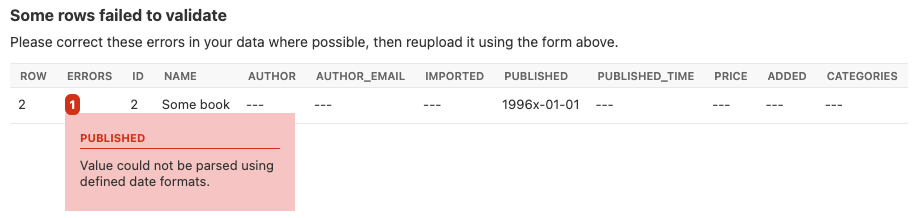
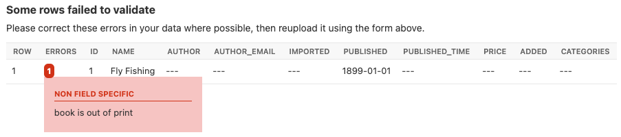

==============
Advanced usage
==============

Customize resource options
==========================

By default :class:`~import_export.resources.ModelResource` introspects model
fields and creates :class:`~import_export.fields.Field` attributes with an
appropriate :class:`~import_export.widgets.Widget` for each field.

Fields are generated automatically by introspection on the declared model class.  The field defines the relationship
between the resource we are importing (for example, a csv row) and the instance we want to update.  Typically, the row
data will map onto a single model instance.  The row data will be set onto model instance attributes (including instance
relations) during the import process.

In a simple case, the name of the row headers will map exactly onto the names of the model attributes, and the import
process will handle this mapping.  In more complex cases, model attributes and row headers may differ, and we will need
to declare explicitly declare this mapping. See :ref:`field_declaration` for more information.

.. _declare_fields:

Declare fields
--------------

You can optionally use the ``fields`` declaration to affect which fields are handled during import / export.

To affect which model fields will be included in a resource, use the ``fields`` option to whitelist fields::

    class BookResource(resources.ModelResource):

        class Meta:
            model = Book
            fields = ('id', 'name', 'price',)

Or the ``exclude`` option to blacklist fields::

    class BookResource(resources.ModelResource):

        class Meta:
            model = Book
            exclude = ('imported', )

If both ``fields`` and ``exclude`` are declared, the ``fields`` declaration takes precedence, and ``exclude`` is
ignored.

.. _field_ordering:

Field ordering
--------------

When importing or exporting, the ordering defined by ``fields`` is used, however an explicit order for importing or
exporting fields can be set using the either the ``import_order`` or ``export_order`` options::

    class BookResource(resources.ModelResource):

        class Meta:
            model = Book
            fields = ('id', 'name', 'author', 'price',)
            import_order = ('id', 'price',)
            export_order = ('id', 'price', 'author', 'name')

The precedence for the order of fields for import / export is defined as follows:

  * ``import_order`` or ``export_order`` (if defined)
  * ``fields`` (if defined)
  * The order derived from the underlying model instance.

Where ``import_order`` or ``export_order`` contains a subset of ``fields`` then the ``import_order`` and
``export_order`` fields will be processed first.

If no ``fields``, ``import_order`` or ``export_order`` is defined then fields are created via introspection of the model
class.  The order of declared fields in the model instance is preserved, and any non-model fields are last in the
ordering.

Model relations
---------------

When defining :class:`~import_export.resources.ModelResource` fields it is possible to follow model relationships::

    class BookResource(resources.ModelResource):

        class Meta:
            model = Book
            fields = ('author__name',)

This example declares that the ``Author.name`` value (which has a foreign key relation to ``Book``) will appear in the
export.

Declaring the relationship using this syntax means the following:

  * The field will be skipped when importing data. To understand how to import model relations, see
    :ref:`import_model_relations`.

  * The default string value of the field will be exported. To have full control over the format of the export,
    see :ref:`field_declaration`.

.. _field_declaration:

Explicit field declaration
--------------------------

We can declare fields explicitly to give us more control over the relationship between the row and the model attribute.
In the example below, we use the ``attribute`` kwarg to define the model attribute, and ``column_name`` to define the
column name (i.e. row header)::

    from import_export.fields import Field

    class BookResource(resources.ModelResource):
        published_field = Field(attribute='published', column_name='published_date')

        class Meta:
            model = Book

The ``attribute`` parameter is optional, and if omitted it means that:

  1. The field will be ignored during import.

  2. The field will be present during export, but will have an empty value unless a
     :ref:`dehydrate<advanced_data_manipulation_on_export>` method is defined.

If using the ``fields`` attribute to :ref:`declare fields<field_declaration>` then the declared resource attribute
name must appear in the ``fields`` list::

    class BookResource(ModelResource):
        published_field = Field(attribute='published', column_name='published_date')

        class Meta:
            fields = ("published_field",)
            model = Book

.. seealso::

    :doc:`/api_fields`
        Available field types and options.

    :ref:`field_widgets`

.. _field_widgets:

Field widgets
=============

A widget is an object associated with each field declaration.  The widget has two roles:

1. Transform the raw import data into a python object which is associated with the instance (see :meth:`.clean`).
2. Export persisted data into a suitable export format (see :meth:`.render`).

There are widgets associated with character data, numeric values, dates, foreign keys.  You can also define your own
widget and associate it with the field.

A :class:`~import_export.resources.ModelResource` creates fields with a default widget for a given field type via
introspection.  If the widget should be initialized with different arguments, this can be done via an explicit
declaration or via the widgets dict.

For example, the ``published`` field is overridden to use a different date format. This format will be used both for
importing and exporting resource::

    class BookResource(resources.ModelResource):
        published = Field(attribute='published', column_name='published_date',
            widget=DateWidget(format='%d.%m.%Y'))

        class Meta:
            model = Book

Alternatively, widget parameters can be overridden using the widgets dict declaration::

    class BookResource(resources.ModelResource):

        class Meta:
            model = Book
            widgets = {
                'published': {'format': '%d.%m.%Y'},
            }

Declaring fields may affect the export order of the fields.  If this is an issue, you can declare the
:attr:`~import_export.options.ResourceOptions.export_order` attribute. See :ref:`field_ordering`.

.. _modify_render_return_type:

Modify :meth:`.render` return type
----------------------------------

By default, :meth:`.render` will return a string type for export.  There may be use cases where a native type is
required from export.  If so, you can use the ``coerce_to_string`` parameter if the widget supports it.

By default, ``coerce_to_string`` is ``True``, but if you set this to ``False``, then the native type will be returned
during export::

    class BookResource(resources.ModelResource):
        published = Field(widget=DateWidget(coerce_to_string=False))

        class Meta:
            model = Book

If exporting via the Admin interface, the export logic will detect if exporting to either XLSX, XLS or ODS format,
and will set native types for *Numeric*, *Boolean* and *Date* values.  This means that the ``coerce_to_string`` value
will be ignored and the native types will be returned.  This is because in most use-cases the native type will be
expected in the exported format.  If you need to modify this behavior and enforce string types in "binary" file formats
then the only way to do this is to override the widget ``render()`` method.

.. seealso::

    :doc:`/api_widgets`
        Available widget types and options.

Custom workflow based on import values
--------------------------------------

You can extend the import process to add workflow based on changes to persisted model instances.

For example, suppose you are importing a list of books and you require additional workflow on the date of publication.
In this example, we assume there is an existing unpublished book instance which has a null 'published' field.

There will be a one-off operation to take place on the date of publication, which will be identified by the presence of
the 'published' field in the import file.

To achieve this, we need to test the existing value taken from the persisted instance (i.e. prior to import
changes) against the incoming value on the updated instance.
Both ``instance`` and ``original`` are attributes of :class:`~import_export.results.RowResult`.

You can override the :meth:`~import_export.resources.Resource.after_import_row` method to check if the
value changes::

  class BookResource(resources.ModelResource):

    def after_import_row(self, row, row_result, **kwargs):
        if getattr(row_result.original, "published") is None \
            and getattr(row_result.instance, "published") is not None:
            # import value is different from stored value.
            # exec custom workflow...

    class Meta:
        model = Book
        store_instance = True

.. note::

  * The ``original`` attribute will be null if :attr:`~import_export.options.ResourceOptions.skip_diff` is True.
  * The ``instance`` attribute will be null if :attr:`~import_export.options.ResourceOptions.store_instance` is False.

Validation during import
========================

The import process will include basic validation during import.  This validation can be customized or extended if
required.

The import process distinguishes between:

#. Validation errors which arise when failing to parse import data correctly.

#. General exceptions which arise during processing.

Errors are retained as :class:`~import_export.results.Error` instances in each :class:`~import_export.results.RowResult`
instance, which is stored in the single :class:`~import_export.results.Result` instance which is returned from the
import process.

The :meth:`~import_export.resources.Resource.import_data` method takes optional parameters which can be used to
customize the handling of errors.  Refer to the method documentation for specific details.

Validation Errors
-----------------

During import of a row, each field is iterated and any `ValueError <https://docs.python.org/3/library/exceptions.html#ValueError/>`_
errors raised by Widgets are stored in an instance of Django's
`ValidationError <https://docs.djangoproject.com/en/stable/ref/forms/validation/>`_.

Validation errors are retained within the :attr:`~import_export.results.Result.invalid_rows` list as a
:class:`~import_export.results.InvalidRow` instance.

If importing programmatically, you can set the ``raise_errors`` parameter of :meth:`~import_export.resources.Resource.import_data`
to ``True``, which will mean the process will exit at the first row which has errors::

    rows = [
        (1, 'Lord of the Rings', '1996-01-01'),
        (2, 'The Hobbit', '1996-01-02x'),
    ]
    dataset = tablib.Dataset(*rows, headers=['id', 'name', 'published'])
    resource = BookResource()
    self.resource.import_data(self.dataset, raise_errors=True)

The above process will exit with a row number and error (formatted for clarity)::

  ImportError: 2: {'published': ['Value could not be parsed using defined date formats.']}
    (OrderedDict({'id': 2, 'name': 'The Hobbit', 'published': 'x'}))

To iterate over all validation errors produced from an import, pass ``False`` to ``raise_errors``::

    result = self.resource.import_data(self.dataset, raise_errors=False)
    for row in result.invalid_rows:
        print(f"--- row {row.number} ---")
        for field, error in row.error.error_dict.items():
            print(f"{field}: {error} ({row.values})")

If using the :ref:`Admin UI<admin-integration>`, errors are presented to the user during import (see below).

Generic Errors
--------------

Generic errors are raised during import for cases which are not validation errors.
For example, generic errors are usually raised at the point the model instance is saved, such as attempt to save a float
to a int field.  Because generic errors are raised from a lower point in the stack, it is not always possible to
identify which field caused the error.

Generic errors are retained within the :attr:`~import_export.results.Result.error_rows` list as a
:class:`~import_export.results.ErrorRow` instance.

The ``raise_errors`` parameter can be used during programmatic import to halt the import at the first error::

    rows = [
        (1, 'Lord of the Rings', '999'),
        (2, 'The Hobbit', 'x'),
    ]
    dataset = tablib.Dataset(*rows, headers=['id', 'name', 'price'])
    resource = BookResource()
    result = resource.import_data(
        dataset,
        raise_errors=True
    )

The above process will exit with a row number and error (formatted for clarity)::

  ImportError: 1: [<class 'decimal.ConversionSyntax'>]
    (OrderedDict({'id': 1, 'name': 'Lord of the Rings', 'price': '1x'}))

To iterate over all generic errors produced from an import, pass ``False`` to ``raise_errors``::

    result = self.resource.import_data(self.dataset, raise_errors=False)
    for row in result.error_rows:
        print(f"--- row {row.number} ---")
        for field, error in row.error.error_dict.items():
            print(f"{field}: {error} ({error.row})")

.. note::

  `full_clean() <https://docs.djangoproject.com/en/stable/ref/models/instances/#django.db.models.Model.full_clean>`_
  is only called on the model instance if the Resource option
  :attr:`~import_export.options.ResourceOptions.clean_model_instances` is enabled.

Field level validation
----------------------

Validation of input can be performed during import by a widget's :meth:`~import_export.widgets.Widget.clean` method by
raising a `ValueError <https://docs.python.org/3/library/exceptions.html#ValueError/>`_.
Consult the :doc:`widget documentation </api_widgets>` for more information.

You can supply your own field level validation by overriding :meth:`~import_export.widgets.Widget.clean`, for example::

  class PositiveIntegerWidget(IntegerWidget):
    """Returns a positive integer value"""

    def clean(self, value, row=None, **kwargs):
        val = super().clean(value, row=row, **kwargs)
        if val < 0:
            raise ValueError("value must be positive")
        return val

Field level errors will be presented in the :ref:`Admin UI<admin-integration>`, for example:

  A screenshot showing a field specific error.

Instance level validation
-------------------------

You can optionally configure import-export to perform model instance validation during import by enabling the
:attr:`~import_export.options.ResourceOptions.clean_model_instances` attribute.

You can override the
`full_clean() <https://docs.djangoproject.com/en/stable/ref/models/instances/#django.db.models.Model.full_clean>`_
method to provide extra validation, either at field or instance level::

    class Book(models.Model):

        def full_clean(self, exclude=None, validate_unique=True):
            super().full_clean(exclude, validate_unique)

            # non field specific validation
            if self.published < date(1900, 1, 1):
                raise ValidationError("book is out of print")

            # field specific validation
            if self.name == "Ulysses":
                raise ValidationError({"name": "book has been banned"})

  A screenshot showing a non field specific error.

Customize error handling
------------------------

You are free to subclass or replace the classes defined in :mod:`~import_export.results`.  Override any or all of the
following hooks to customize error handling:

* :meth:`~import_export.resources.Resource.get_result_class`
* :meth:`~import_export.resources.Resource.get_row_result_class`
* :meth:`~import_export.resources.Resource.get_error_result_class`

.. _import_model_relations:

Importing model relations
=========================

If you are importing data for a model instance which has a foreign key relationship to another model then import-export
can handle the lookup and linking to the related model.

Foreign Key relations
---------------------

``ForeignKeyWidget`` allows you to declare a reference to a related model.  For example, if we are importing a 'book'
csv file, then we can have a single field which references an author by name.

::

  id,title,author
  1,The Hobbit, J. R. R. Tolkien

We would have to declare our ``BookResource`` to use the author name as the foreign key reference::

        from import_export import fields
        from import_export.widgets import ForeignKeyWidget

        class BookResource(resources.ModelResource):
            author = fields.Field(
                column_name='author',
                attribute='author',
                widget=ForeignKeyWidget(Author, field='name'))

            class Meta:
                model = Book
                fields = ('author',)

By default, ``ForeignKeyWidget`` will use 'pk' as the lookup field, hence we have to pass 'name' as the lookup field.
This relies on 'name' being a unique identifier for the related model instance, meaning that a lookup on the related
table using the field value will return exactly one result.

This is implemented as a ``Model.objects.get()`` query, so if the instance in not uniquely identifiable based on the
given arg, then the import process will raise either ``DoesNotExist`` or ``MultipleObjectsReturned`` errors.

See also :ref:`creating-non-existent-relations`.

Refer to the :class:`~.ForeignKeyWidget` documentation for more detailed information.

.. note::

    If you are exporting a field which uses ``ForeignKeyWidget`` then the default formatting for the field will be
    applied.
    If you need better control over the format of the exported value (for example, formatting a date), then use a
    :ref:`dehydrate<advanced_data_manipulation_on_export>` method or create a subclass of ``ForeignKeyWidget``.
    Override :meth:`~import_export.widgets.Widget.render` to create custom formatting of output.

Many-to-many relations
----------------------

``ManyToManyWidget`` allows you to import m2m references.  For example, we can import associated categories with our
book import.  The categories refer to existing data in a ``Category`` table, and are uniquely referenced by category
name.  We use the pipe separator in the import file, which means we have to declare this in the ``ManyToManyWidget``
declaration.

::

  id,title,categories
  1,The Hobbit,Fantasy|Classic|Movies

::

    class BookResource(resources.ModelResource):
        categories = fields.Field(
            column_name='categories',
            attribute='categories',
            widget=widgets.ManyToManyWidget(Category, field='name', separator='|')
        )

        class Meta:
            model = Book

.. _creating-non-existent-relations:

Creating non-existent relations
-------------------------------

The examples above rely on the relation data being present prior to the import.  It is a common use-case to create the
data if it does not already exist.  A simple way to achieve this is to override the ``ForeignKeyWidget``
:meth:`~import_export.widgets.ForeignKeyWidget.clean` method::

    class AuthorForeignKeyWidget(ForeignKeyWidget):
        def clean(self, value, row=None, **kwargs):
            try:
                val = super().clean(value)
            except Author.DoesNotExist:
                val = Author.objects.create(name=row['author'])
            return val

Now you will need to declare the widget in the Resource::

    class BookResource(resources.ModelResource):

        author = fields.Field(
            attribute="author",
            column_name="author",
            widget=AuthorForeignKeyWidget(Author, "name")
        )

        class Meta:
            model = Book

The code above can be adapted to handle m2m relationships, see
`this thread <https://github.com/django-import-export/django-import-export/issues/318#issuecomment-861813245>`_.

Customize relation lookup
-------------------------

The ``ForeignKeyWidget`` and ``ManyToManyWidget`` widgets will look for relations by searching the entire relation
table for the imported value.  This is implemented in the :meth:`~import_export.widgets.ForeignKeyWidget.get_queryset`
method.  For example, for an ``Author`` relation, the lookup calls ``Author.objects.all()``.

In some cases, you may want to customize this behaviour, and it can be a requirement to pass dynamic values in.
For example, suppose we want to look up authors associated with a certain publisher id.  We can achieve this by passing
the publisher id into the ``Resource`` constructor, which can then be passed to the widget::

    class BookResource(resources.ModelResource):

        def __init__(self, publisher_id):
            super().__init__()
            self.fields["author"] = fields.Field(
                attribute="author",
                column_name="author",
                widget=AuthorForeignKeyWidget(publisher_id),
            )

The corresponding ``ForeignKeyWidget`` subclass::

    class AuthorForeignKeyWidget(ForeignKeyWidget):
        model = Author
        field = 'name'

        def __init__(self, publisher_id, **kwargs):
            super().__init__(self.model, field=self.field, **kwargs)
            self.publisher_id = publisher_id

        def get_queryset(self, value, row, *args, **kwargs):
            return self.model.objects.filter(publisher_id=self.publisher_id)

Then if the import was being called from another module, we would pass the ``publisher_id`` into the Resource::

    >>> resource = BookResource(publisher_id=1)

If you need to pass dynamic values to the Resource when importing via the Admin UI, refer to
See :ref:`dynamically_set_resource_values`.

Django Natural Keys
-------------------

The ``ForeignKeyWidget`` also supports using Django's natural key functions. A
manager class with the ``get_by_natural_key`` function is required for importing
foreign key relationships by the field model's natural key, and the model must
have a ``natural_key`` function that can be serialized as a JSON list in order to
export data.

The primary utility for natural key functionality is to enable exporting data
that can be imported into other Django environments with different numerical
primary key sequences. The natural key functionality enables handling more
complex data than specifying either a single field or the PK.

The example below illustrates how to create a field on the ``BookResource`` that
imports and exports its author relationships using the natural key functions
on the ``Author`` model and modelmanager.

The resource _meta option ``use_natural_foreign_keys`` enables this setting
for all Models that support it.

::

    from import_export.fields import Field
    from import_export.widgets import ForeignKeyWidget

    class AuthorManager(models.Manager):

        def get_by_natural_key(self, name):
            return self.get(name=name)

    class Author(models.Model):

        objects = AuthorManager()

        name = models.CharField(max_length=100)
        birthday = models.DateTimeField(auto_now_add=True)

        def natural_key(self):
            return (self.name,)

    # Only the author field uses natural foreign keys.
    class BookResource(resources.ModelResource):

        author = Field(
            column_name = "author",
            attribute = "author",
            widget = ForeignKeyWidget(Author, use_natural_foreign_keys=True)
        )

        class Meta:
            model = Book

    # All widgets with foreign key functions use them.
    class BookResource(resources.ModelResource):

        class Meta:
            model = Book
            use_natural_foreign_keys = True

Read more at `Django Serialization <https://docs.djangoproject.com/en/stable/topics/serialization/>`_.

Create or update model instances
================================

When you are importing a file using import-export, the file is processed row by row. For each row, the
import process is going to test whether the row corresponds to an existing stored instance, or whether a new instance
is to be created.

If an existing instance is found, then the instance is going to be *updated* with the values from the imported row,
otherwise a new row will be created.

In order to test whether the instance already exists, import-export needs to use a field (or a combination of fields)
in the row being imported. The idea is that the field (or fields) will uniquely identify a single instance of the model
type you are importing.

To define which fields identify an instance, use the ``import_id_fields`` meta attribute. You can use this declaration
to indicate which field (or fields) should be used to uniquely identify the row. If you don't declare
``import_id_fields``, then a default declaration is used, in which there is only one field: 'id'.

For example, you can use the 'isbn' number instead of 'id' to uniquely identify a Book as follows::

    class BookResource(resources.ModelResource):

        class Meta:
            model = Book
            import_id_fields = ('isbn',)
            fields = ('isbn', 'name', 'author', 'price',)

.. note::

    If setting ``import_id_fields``, you must ensure that the data can uniquely identify a single row.  If the chosen
    field(s) select more than one row, then a ``MultipleObjectsReturned`` exception will be raised.  If no row is
    identified, then ``DoesNotExist`` exception will be raised.

.. _dynamic_fields:

Using 'dynamic fields' to identify existing instances
-----------------------------------------------------

There are some use-cases where a field defined in ``import_id_fields`` is not present in the dataset.  An example of
this would be dynamic fields, where a field is generated from other data and then used as an identifier.  For example::

    class BookResource(resources.ModelResource):

        def before_import_row(self, row, **kwargs):
            # generate a value for an existing field, based on another field
            row["hash_id"] = hashlib.sha256(row["name"].encode()).hexdigest()

        class Meta:
            model = Book
            # A 'dynamic field' - i.e. is used to identify existing rows
            # but is not present in the dataset
            import_id_fields = ("hash_id",)

In the above example, a dynamic field called *hash_id* is generated and added to the dataset.  In this example, an
error will be raised because *hash_id* is not present in the dataset.  To resolve this, update the dataset before
import to add the dynamic field as a header::

    class BookResource(resources.ModelResource):

        def before_import(self, dataset, **kwargs):
            # mimic a 'dynamic field' - i.e. append field which exists on
            # Book model, but not in dataset
            dataset.headers.append("hash_id")
            super().before_import(dataset, **kwargs)

        def before_import_row(self, row, **kwargs):
            row["hash_id"] = hashlib.sha256(row["name"].encode()).hexdigest()

        class Meta:
            model = Book
            # A 'dynamic field' - i.e. is used to identify existing rows
            # but is not present in the dataset
            import_id_fields = ("hash_id",)

Access instances after import
=============================

Access instance summary data
----------------------------

The instance pk and representation (i.e. output from ``repr()``) can be accessed after import::

    rows = [
        (1, 'Lord of the Rings'),
    ]
    dataset = tablib.Dataset(*rows, headers=['id', 'name'])
    resource = BookResource()
    result = resource.import_data(dataset)

    for row_result in result:
        print("%d: %s" % (row_result.object_id, row_result.object_repr))

Access full instance data
-------------------------

All 'new', 'updated' and 'deleted' instances can be accessed after import if the
:attr:`~import_export.options.ResourceOptions.store_instance` meta attribute is set.

For example, this snippet shows how you can retrieve persisted row data from a result::

    class BookResourceWithStoreInstance(resources.ModelResource):
        class Meta:
            model = Book
            store_instance = True

    rows = [
        (1, 'Lord of the Rings'),
    ]
    dataset = tablib.Dataset(*rows, headers=['id', 'name'])
    resource = BookResourceWithStoreInstance()
    result = resource.import_data(dataset)

    for row_result in result:
        print(row_result.instance.pk)

Handling duplicate data
=======================

If an existing instance is identified during import, then the existing instance will be updated, regardless of whether
the data in the import row is the same as the persisted data or not.  You can configure the import process to skip the
row if it is duplicate by using setting :attr:`~import_export.options.ResourceOptions.skip_unchanged`.

If :attr:`~import_export.options.ResourceOptions.skip_unchanged` is enabled, then the import process will check each
defined import field and perform a simple comparison with the existing instance, and if all comparisons are equal, then
the row is skipped.  Skipped rows are recorded in the row :class:`~import_export.results.RowResult` object.

You can override the :meth:`~.skip_row` method to have full control over the skip row implementation.

Also, the :attr:`~import_export.options.ResourceOptions.report_skipped` option controls whether skipped records appear
in the import :class:`~import_export.results.RowResult` object, and whether skipped records will show in the import
preview page in the Admin UI::

    class BookResource(resources.ModelResource):

        class Meta:
            model = Book
            skip_unchanged = True
            report_skipped = False
            fields = ('id', 'name', 'price',)

.. seealso::

    :doc:`/api_resources`

How to set a value on all imported instances prior to persisting
================================================================

You may have a use-case where you need to set the same value on each instance created during import.
For example, it might be that you need to set a value read at runtime on all instances during import.

You can define your resource to take the associated instance as a param, and then set it on each import instance::

    class BookResource(ModelResource):

        def __init__(self, publisher_id):
            self.publisher_id = publisher_id

        def before_save_instance(self, instance, row, **kwargs):
            instance.publisher_id = self.publisher_id

        class Meta:
            model = Book

See :ref:`dynamically_set_resource_values`.

.. _advanced_data_manipulation_on_export:

Data manipulation on export
===========================

Not all data can be easily extracted from an object/model attribute.
In order to turn complicated data model into a (generally simpler) processed
data structure on export, ``dehydrate_<fieldname>`` method should be defined::

    from import_export.fields import Field

    class BookResource(resources.ModelResource):
        full_title = Field()

        class Meta:
            model = Book

        def dehydrate_full_title(self, book):
            book_name = getattr(book, "name", "unknown")
            author_name = getattr(book.author, "name", "unknown")
            return '%s by %s' % (book_name, author_name)

In this case, the export looks like this:

    >>> from app.admin import BookResource
    >>> dataset = BookResource().export()
    >>> print(dataset.csv)
    full_title,id,name,author,author_email,imported,published,price,categories
    Some book by 1,2,Some book,1,,0,2012-12-05,8.85,1

It is also possible to pass a method name or a callable to the :meth:`~import_export.fields.Field` constructor.
If this method name or callable is supplied, then it will be called as the 'dehydrate' method. For example::

    from import_export.fields import Field

    # Using method name
    class BookResource(resources.ModelResource):
        full_title = Field(dehydrate_method='custom_dehydrate_method')

        class Meta:
            model = Book

        def custom_dehydrate_method(self, book):
            return f"{book.name} by {book.author.name}"

    # Using a callable directly
    def custom_dehydrate_callable(book):
        return f"{book.name} by {book.author.name}"

    class BookResource(resources.ModelResource):
        full_title = Field(dehydrate_method=custom_dehydrate_callable)

        class Meta:
            model = Book

Filtering querysets during export
=================================

You can use :meth:`~import_export.resources.Resource.filter_export` to filter querysets
during export.  See also :ref:`customize_admin_export_forms`.

Modify dataset after export
===========================

The :meth:`~import_export.resources.Resource.after_export` method allows you to modify the
`tablib <https://tablib.readthedocs.io/en/stable/tutorial.html>`_ dataset before it is rendered in the export format.

This can be useful for adding dynamic columns or applying custom logic to the final dataset.

Import and export with different fields
=======================================

If you would like to import one set of fields, and then export a different set, then the recommended way to do this
is to define two resources::

    class BookImportResource(ModelResource):
        class Meta:
            model = Book
            fields = ["id", "name"]

    class BookExportResource(ModelResource):
        class Meta:
            model = Book
            fields = ["id", "name", "published"]

If you are using these resources in the Admin UI, declare them in your
:ref:`admin class<import_export_skip_admin_confirm>`.

Modify xlsx format
==================

It is possible to modify the output of any XLSX export.  The output bytes can be read and then modified using the
`openpyxl <https://openpyxl.readthedocs.io/en/stable/>`_ library (which can be included as an import_export
dependency).

You can override :meth:`~import_export.admin.ExportMixin.get_export_data` as follows::

    def get_export_data(self, file_format, request, queryset, **kwargs):
        blob = super().get_export_data(file_format, request, queryset, **kwargs)
        workbook_data = BytesIO(blob)
        workbook_data.seek(0)
        wb = openpyxl.load_workbook(workbook_data)
        # modify workbook as required
        output = BytesIO()
        wb.save(output)
        return output.getvalue()

Custom export file name
=======================

Customize the export file name by overriding :meth:`~import_export.admin.ExportMixin.get_export_filename`.

Signals
=======

To hook in the import-export workflow, you can connect to ``post_import``,
``post_export`` signals::

    from django.dispatch import receiver
    from import_export.signals import post_import, post_export

    @receiver(post_import, dispatch_uid='balabala...')
    def _post_import(model, **kwargs):
        # model is the actual model instance which after import
        pass

    @receiver(post_export, dispatch_uid='balabala...')
    def _post_export(model, **kwargs):
        # model is the actual model instance which after export
        pass

.. _concurrent-writes:

Concurrent writes
=================

There is specific consideration required if your application allows concurrent writes to data during imports.

For example, consider this scenario:

#. An import process is run to import new books identified by title.
#. The :meth:`~import_export.resources.Resource.get_or_init_instance` is called and identifies that there is no
   existing book with this title, hence the import process will create it as a new record.
#. At that exact moment, another process inserts a book with the same title.
#. As the row import process completes, :meth:`~import_export.resources.Resource.save` is called and an error is thrown
   because the book already exists in the database.

By default, import-export does not prevent this situation from occurring, therefore you need to consider what processes
might be modifying shared tables during imports, and how you can mitigate risks.  If your database enforces integrity,
then you may get errors raised, if not then you may get duplicate data.

Potential solutions are:

* Use one of the :doc:`import workflow<import_workflow>` methods to lock a table during import if the database supports
  it.

  * This should only be done in exceptional cases because there will be a performance impact.
  * You will need to release the lock both in normal workflow and if there are errors.

* Override :meth:`~import_export.resources.Resource.do_instance_save` to perform a
  `update_or_create() <https://docs.djangoproject.com/en/stable/ref/models/querysets/#update_or_create>`_.
  This can ensure that data integrity is maintained if there is concurrent access.

* Modify working practices so that there is no risk of concurrent writes. For example, you could schedule imports to
  only run at night.

This issue may be more prevalent if using :doc:`bulk imports<bulk_import>`.  This is because instances are held in
memory for longer before being written in bulk, therefore there is potentially more risk of another process modifying
an instance before it has been persisted.

Additional configuration
========================

Please refer to the :doc:`API documentation<api_resources>` for additional configuration options.
