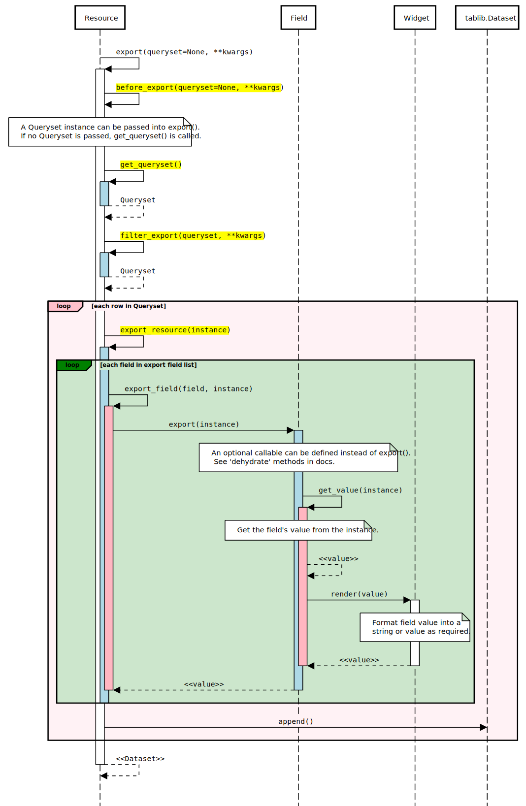

====================
Export workflow
====================

This document describes the export data workflow in detail, with hooks that enable
customization of the export process.

Methods highlighted in yellow in the sequence diagram indicate public methods which can
be overridden.

The :meth:`~import_export.resources.Resource.export` method retrieves a ``QuerySet``
from the database and formats into a :class:`tablib.Dataset`.

Various hook methods are defined to allow you to customize the export data.

This is what happens when the method is invoked:

#. The :meth:`~import_export.resources.Resource.export` method is passed an optional
   queryset parameter.  The ``kwargs`` dict can hold additional information used to
   create the export, for example if called from the Admin UI.

#. The :meth:`~import_export.resources.Resource.before_export` hook is called.

#. If no ``QuerySet`` has been passed, then
   :meth:`~import_export.resources.Resource.get_queryset` method is called.

#. The :meth:`~import_export.resources.Resource.filter_export` hook is called.
   You can override this method to modify the queryset for export.

#. For each instance in the ``QuerySet``,
   :meth:`~import_export.resources.Resource.export_resource` is called (with the
   instance passed as a parameter).

#. For each field defined in :attr:`~import_export.options.ResourceOptions.fields`:

   * :meth:`~import_export.resources.Resource.export_field` is called with the field and
     instance as parameters.

   * If a :ref:`dehydrate<advanced_data_manipulation_on_export>`  method is defined on
     the ``Resource``, then this method is called to extract the field value,
     Otherwise :meth:`~import_export.fields.Field.export` is called for each defined
     field, with the instance passed as a parameter.

   * :meth:`~import_export.fields.Field.get_value` is called with the instance to
     retrieve the export value from the instance.export

   * The field's widget :meth:`~import_export.widgets.Widget.render` method is called
     to retrieve the export value.

#. Each value is appended to a :class:`tablib.Dataset`.

#. The :class:`tablib.Dataset` is returned from
   :meth:`~import_export.resources.Resource.export`.
