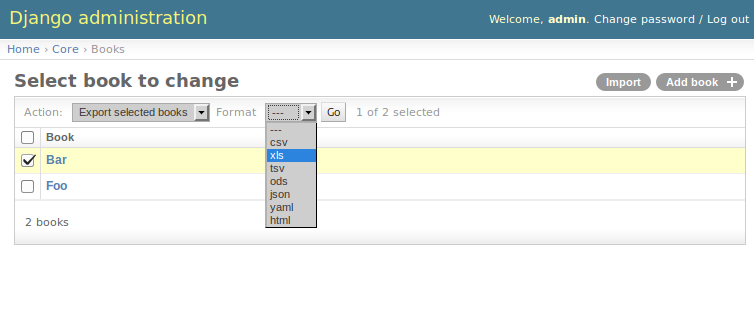

===============
Getting started
===============

For example purposes, we'll use a simplified book app. Here is our
``core.models.py``::

    class Author(models.Model):
        name = models.CharField(max_length=100)

        def __unicode__(self):
            return self.name

    class Category(models.Model):
        name = models.CharField(max_length=100)

        def __unicode__(self):
            return self.name

    class Book(models.Model):
        name = models.CharField('Book name', max_length=100)
        author = models.ForeignKey(Author, blank=True, null=True)
        author_email = models.EmailField('Author email', max_length=75, blank=True)
        imported = models.BooleanField(default=False)
        published = models.DateField('Published', blank=True, null=True)
        price = models.DecimalField(max_digits=10, decimal_places=2, null=True,
                blank=True)
        categories = models.ManyToManyField(Category, blank=True)

        def __unicode__(self):
            return self.name

.. _base-modelresource:

Creating import-export resource
-------------------------------

To integrate `django-import-export` with ``Book`` model, we will create
a resource class in ``admin.py`` that will describe how this resource can be imported or
exported.

::

    from import_export import resources
    from core.models import Book

    class BookResource(resources.ModelResource):

        class Meta:
            model = Book

Exporting data
--------------

Now that we have defined a resource class, we can export books::

    >>> dataset = BookResource().export()
    >>> print dataset.csv
    id,name,author,author_email,imported,published,price,categories
    2,Some book,1,,0,2012-12-05,8.85,1

Customize resource options
--------------------------

By default ``ModelResource`` introspects model fields and creates
``import_export.fields.Field`` attributes with an appropriate widget
for each field.

To affect which model fields will be included in an import-export
resource, use the ``fields`` option to whitelist fields::

    class BookResource(resources.ModelResource):

        class Meta:
            model = Book
            fields = ('id', 'name', 'price',)

Or the ``exclude`` option to blacklist fields::

    class BookResource(resources.ModelResource):

        class Meta:
            model = Book
            exclude = ('imported', )

An explicit order for exporting fields can be set using the ``export_order`` option::

    class BookResource(resources.ModelResource):

        class Meta:
            model = Book
            fields = ('id', 'name', 'author', 'price',)
            export_order = ('id', 'price', 'author', 'name')

The default field for object identification is ``id``, you can optionally set which fields are used as the ``id`` when importing::

    class BookResource(resources.ModelResource):

        class Meta:
            model = Book
            import_id_fields = ('isbn',)
            fields = ('isbn', 'name', 'author', 'price',)

When defining ``ModelResource`` fields it is possible to follow
model relationships::

    class BookResource(resources.ModelResource):

        class Meta:
            model = Book
            fields = ('author__name',)

.. note::

    Following relationship fields sets ``field`` as readonly, meaning
    this field will be skipped when importing data.

By default all records will be imported, even if no changes are detected.
This can be changed setting the ``skip_unchanged`` option. Also, the ``report_skipped`` option
controls whether skipped records appear in the import ``Result`` object, and if using the admin
whether skipped records will show in the import preview page::

    class BookResource(resources.ModelResource):

        class Meta:
            model = Book
            skip_unchanged = True
            report_skipped = False
            fields = ('id', 'name', 'price',)

.. seealso::

    :doc:`/api_resources`
        

Declaring fields
----------------

It is possible to override a resource field to change some of its
options::

    from import_export import fields

    class BookResource(resources.ModelResource):
        published = fields.Field(column_name='published_date')
        
        class Meta:
            model = Book

Other fields that don't exist in the target model may be added::

    from import_export import fields
    
    class BookResource(resources.ModelResource):
        myfield = fields.Field(column_name='myfield')

        class Meta:
            model = Book

.. seealso::

    :doc:`/api_fields`
        Available field types and options.

Advanced data manipulation
--------------------------

Not all data can be easily extracted from an object/model attribute.
In order to turn complicated data model into a (generally simpler) processed
data structure, ``dehydrate_<fieldname>`` method should be defined::

    from import_export import fields

    class BookResource(resources.ModelResource):
        full_title = fields.Field()
        
        class Meta:
            model = Book

        def dehydrate_full_title(self, book):
            return '%s by %s' % (book.name, book.author.name)

Customize widgets
-----------------

``ModelResource`` creates a field with a default widget for a given field
type. If the widget should be initialized with different arguments, set the
``widgets`` dict.

In this example widget, the ``published`` field is overriden to use a
different date format. This format will be used both for importing
and exporting resource.

::

    class BookResource(resources.ModelResource):
        
        class Meta:
            model = Book
            widgets = {
                    'published': {'format': '%d.%m.%Y'},
                    }

.. seealso::

    :doc:`/api_widgets`
        available widget types and options.

Importing data
--------------

Let's import data::

    >>> import tablib
    >>> from import_export import resources
    >>> from core.models import Book
    >>> book_resource = resources.modelresource_factory(model=Book)()
    >>> dataset = tablib.Dataset(['', 'New book'], headers=['id', 'name'])
    >>> result = book_resource.import_data(dataset, dry_run=True)
    >>> print result.has_errors()
    False
    >>> result = book_resource.import_data(dataset, dry_run=False)

In 4th line we use ``modelresource_factory`` to create a default
``ModelResource``. ModelResource class created this way is equal
as in :ref:`base-modelresource`.

In 5th line a ``Dataset`` with subset of ``Book`` fields is created.

In rest of code we first pretend to import data with ``dry_run`` set, then
check for any errors and import data.

.. seealso::

    :doc:`/import_workflow`
        for detailed import workflow descripton and customization options.

Deleting data
^^^^^^^^^^^^^

To delete objects during import, implement ``for_delete`` method on resource
class.

Example resource with ``delete`` field::

    class BookResource(resources.ModelResource):
        delete = fields.Field(widget=widgets.BooleanWidget())

        def for_delete(self, row, instance):
            return self.fields['delete'].clean(row)
        
        class Meta:
            model = Book

Import of this resource will delete model instances for rows
that have column ``delete`` set to ``1``.

Admin integration
-----------------

Admin integration is achived by subclassing (in ``admin.py``)
``ImportExportModelAdmin`` or one of the available mixins (``ImportMixin``, 
``ExportMixin``, or ``ImportExportMixin``)::

    from import_export.admin import ImportExportModelAdmin

    class BookAdmin(ImportExportModelAdmin):
        resource_class = BookResource
        pass

.. figure:: _static/images/django-import-export-change.png

   A screenshot of the change view with Import and Export buttons.

.. figure:: _static/images/django-import-export-import.png

   A screenshot of the import view.

.. figure:: _static/images/django-import-export-import-confirm.png

   A screenshot of the confirm import view.

|

Another approach to exporting data is by subclassing
``ImportExportActionModelAdmin`` which implements export as an admin action.
As a result it's possible to export a list of objects selected on the change
list page::

    from import_export.admin import ImportExportActionModelAdmin

    class BookAdmin(ImportExportActionModelAdmin):
        resource_class = BookResource
        pass

   A screenshot of the change view with Import and Export as an admin action.

|

.. seealso::

    :doc:`/api_admin`
        available mixins and options.
