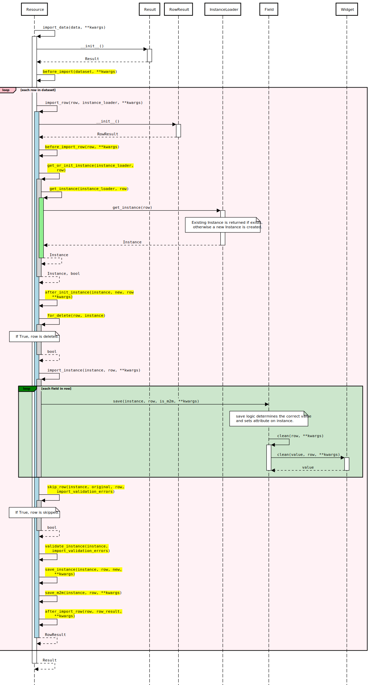

====================
Import workflow
====================

This document describes the import data workflow in detail, with hooks that enable
customization of the import process.

Methods highlighted in yellow in the sequence diagram indicate public methods which can
be overridden.

The :meth:`~import_export.resources.Resource.import_data` method of
:class:`~import_export.resources.Resource` is responsible for importing data
from a given dataset.  Refer to the method documentation for parameters to this method.

This is what happens when the method is invoked:

#. First, a new :class:`~import_export.results.Result` instance, which holds
   errors and other information gathered during the import, is initialized.

   Then, an :class:`~import_export.instance_loaders.BaseInstanceLoader` responsible
   for loading existing instances is initialized. A different
   :class:`~import_export.instance_loaders.BaseInstanceLoader` can be specified
   via :class:`~import_export.options.ResourceOptions`'s
   ``instance_loader_class`` attribute. A
   :class:`~import_export.instance_loaders.CachedInstanceLoader` can be used to
   reduce number of database queries. See the :mod:`~import_export.instance_loaders`
   for available implementations.

#. The :meth:`~import_export.resources.Resource.before_import` hook is called.
   By implementing this method in your resource, you can customize the import process.

#. Each row of the to-be-imported dataset is processed according to the
   following steps:

   * The :meth:`~import_export.resources.Resource.before_import_row` hook is
     called to allow for row data to be modified before it is imported.

   * :meth:`~import_export.resources.Resource.get_or_init_instance` is called
     with current :class:`~import_export.instance_loaders.BaseInstanceLoader`
     and current row of the dataset, returning an object and a Boolean
     declaring if the object is newly created or not.

     If no object can be found for the current row,
     :meth:`~import_export.resources.Resource.init_instance` is invoked to
     initialize an object.

     As always, you can override the implementation of
     :meth:`~import_export.resources.Resource.init_instance` to customize
     how the new object is created (i.e. set default values).

   * :meth:`~import_export.resources.Resource.for_delete` is called to
     determine if the passed ``instance``
     should be deleted. In this case, the import process for the current row
     is stopped at this point.

   * If the instance was not deleted in the previous step,
     :meth:`~import_export.resources.Resource.import_row` is called with the
     ``instance`` as current object instance, ``row`` as current row.

     :meth:`~import_export.resources.Resource.import_field` is called for
     each field in :class:`~import_export.resources.Resource` skipping many-
     to-many fields. Many-to-many fields are skipped because they require
     instances to have a primary key and therefore assignment is postponed to
     when the object has already been saved.

     :meth:`~import_export.resources.Resource.import_field` in turn calls
     :meth:`~import_export.fields.Field.save`, if ``Field.attribute`` is set
     and ``Field.column_name`` exists in the given row.

   * It then is determined whether the newly imported object is different
     from the already present object and if therefore the given row should be
     skipped or not. This is handled by calling
     :meth:`~import_export.resources.Resource.skip_row` with ``original`` as
     the original object and ``instance`` as the current object from the dataset.

     If the current row is to be skipped, ``row_result.import_type`` is set
     to ``IMPORT_TYPE_SKIP``.

   * If the current row is not to be skipped,
     :meth:`~import_export.resources.Resource.save_instance` is called and
     actually saves the instance when ``dry_run`` is not set.

     There are two hook methods (that by default do nothing) giving you the
     option to customize the import process:

       * :meth:`~import_export.resources.Resource.before_save_instance`
       * :meth:`~import_export.resources.Resource.after_save_instance`

   * :meth:`~import_export.resources.Resource.save_m2m` is called to save
     many to many fields.

   * :class:`~import_export.results.RowResult` is assigned with a diff
     between the original and the imported object fields, as well as and
     ``import_type`` attribute which states whether the row is new, updated,
     skipped or deleted.

     If an exception is raised during row processing and
     :meth:`~import_export.resources.Resource.import_row` was invoked with
     ``raise_errors=False`` (which is the default) the particular traceback
     is appended to :class:`~import_export.results.RowResult` as well.

     If either the row was not skipped or the
     :class:`~import_export.resources.Resource` is configured to report
     skipped rows, the :class:`~import_export.results.RowResult` is appended
     to the :class:`~import_export.results.Result`

   * The :meth:`~import_export.resources.Resource.after_import_row` hook is called

#. The :class:`~import_export.results.Result` is returned.

Transaction support
-------------------

If transaction support is enabled, whole import process is wrapped inside
transaction and rolled back or committed respectively.
All methods called from inside of :meth:`~import_export.resources.Resource.import_data`
(create / delete / update) receive ``False`` for ``dry_run`` argument.

.. _Dataset: https://tablib.readthedocs.io/en/stable/api/#dataset-object
