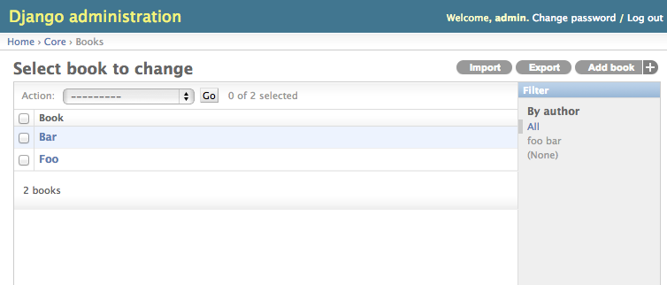

======================
Django import / export
======================

django-import-export is a Django application and library for importing
and exporting data with included admin integration.

Features:

* support multiple formats (Excel, CSV, JSON, ...
  and everything else that `tablib`_ support)

* admin integration for importing

* preview import changes

* admin integration for exporting

* export data respecting admin filters

   A screenshot of the change view with Import and Export buttons.

User Guide
----------

.. toctree::
   :maxdepth: 2

   installation
   configuration
   getting_started
   import_workflow
   example_app
   settings
   todo
   contributing
   changelog

API documentation
-----------------

.. toctree::
   :maxdepth: 2

   api_resources
   api_fields
   api_widgets
   api_instance_loaders
   api_admin
   api_results
   api_tmp_storages

.. _`tablib`: https://github.com/kennethreitz/tablib
