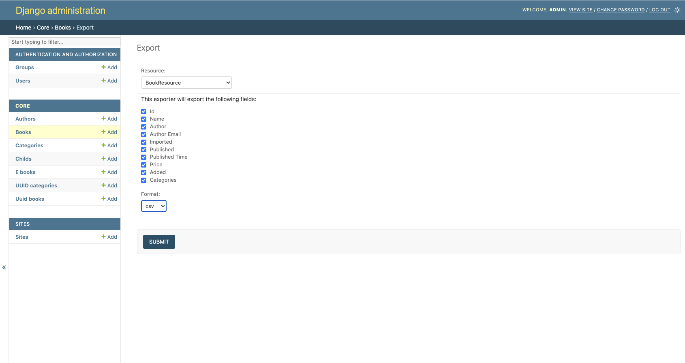

===========
Screenshots
===========

These are some screenshots for the Admin UI of the :ref:`example application<exampleapp>`.

|import-form|

Shows the initial import form with fields for selecting the resource, file and format.

|confirm-import|

Shows the confirmation page which appears prior to committing the import to the database.

|import-complete|

Shows the confirmation page on successful import.

|import-update-with-authors|

Shows the preview page for updating existing records with author details.

|export-selected-action|

Shows selecting records for export.

|export-form|

Shows the export form with fields for selecting the resource, fields and format.
